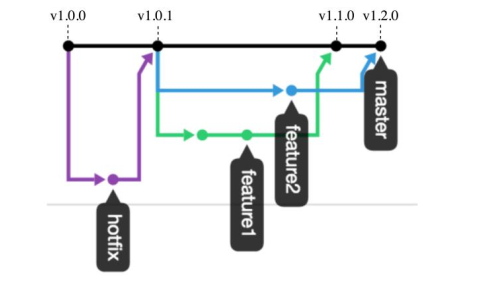

# Workflow test

Generando un flujo de trabajo dentro del diagrama de red (flujo de trabajo),  similar al siguiente:

Los flujos de trabajo tienen en cuenta una rama hotfix, que es necesaria cuando existe un bug crítico o una falla de seguridad.